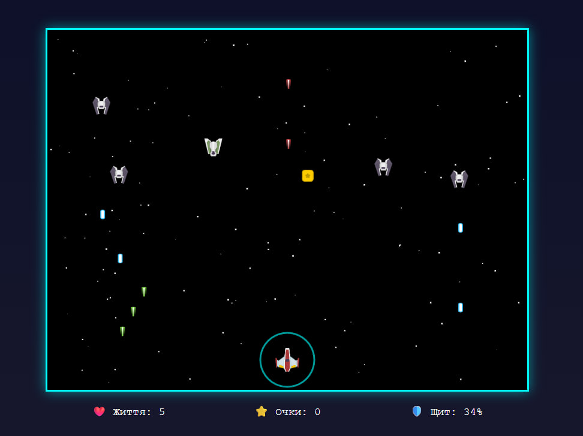

# 🚀 Cosmic Defender

**Космічна аркада** — виживіть якнайдовше та наберіть максимум очок, знищуючи хвилі ворогів у відкритому космосі!



---

## 📖 Опис проєкту

**Cosmic Defender** — це динамічна 2D аркадна гра в стилі класичних космічних шутерів.  
Гра не має рівнів або кінця — це **чиста аркада**, де головна мета гравця — **набір максимальної кількості очок** та виживання якомога довше.

Проєкт створено в рамках курсу **«Основи розроблення комп’ютерних ігор»**.

---

## ✨ Основні особливості

- 🕹️ **Аркадний геймплей** без рівнів — гра триває, поки гравець живий
- 👾 **2 типи звичайних ворогів** з різною поведінкою та атакою
- 💀 **Бос з унікальною супер-атакою**
- 🛡️ **Система щита** для блокування урону
- 🔥 **2 типи підсилень (power-ups)**:
  - супер-атака
  - відновлення здоров’я
- 🎵 **Фонова музика**
- 🔊 **Звукові ефекти** (постріли, вибухи, підбір бонусів)
- ⭐ **Система очок** з різною нагородою за ворогів

---

## 🎮 Управління

| Клавіша | Дія |
|--------|-----|
| ← → або A D | Рух корабля |
| ПРОБІЛ | Стрілянина |
| SHIFT | Активація щита |

---

## 👾 Вороги та очки

| Тип ворога | Опис | Очки |
|-----------|------|------|
| Звичайний ворог | Летить зверху вниз | **10** |
| Горизонтальний ворог | Рухається по горизонталі, складніший для влучання | **30** |
| Бос | Має великий запас здоров’я та супер-атаку | **100** |

🔹 **Бос з’являється після знищення 10 звичайних ворогів**

---

## 🛡️ Механіки гри

### Щит гравця
- Блокує отримання урону
- Має обмежену енергію
- Витрачається при активації
- Автоматично відновлюється з часом

### Підсилення (Power-ups)
- ❤️ **Лікування** — відновлює здоров’я гравця
- 💥 **Супер-атака** — підсилена стрілянина на короткий час

### Бос
- Збільшений запас здоров’я
- Окремий тип атак
- **Супер-атака**, що змушує гравця активно маневрувати

---

## 🛠️ Технології

- **HTML5 Canvas** — рендеринг гри
- **JavaScript (ES6)** — ігрова логіка
- **CSS3** — інтерфейс користувача
- **Git / GitHub** — контроль версій

---

## 🚀 Як запустити

1. Клонуйте репозиторій:
```bash
git clone https://github.com/ВАШ_USERNAME/cosmic-defender.git
```

2. Відкрийте `index.html` в браузері (рекомендовано Chrome або Firefox)

## 🎓 Автор

**Свідерський Ярослав**  
Група: ІМ-23  
